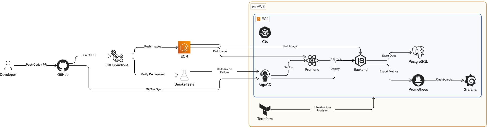

<div align="center">

<h1>AegisMesh</h1>

</div>
A self-hosted IAM platform with policy-driven authorization, step-up authentication, ML-based threat detection, and a full DevSecOps pipeline.

---

## Overview

AegisMesh is a full-stack identity and access management platform built for teams that want AWS IAM-style access controls without handing user data to a third party.

Core design rules:

- DENY always wins over ALLOW when policies conflict.
- Sensitive actions require step-up authentication before they execute.
- Sessions can be revoked individually or in bulk without logging out every device.
- Audit logging is a first-class control, not an afterthought.
- The ML security engine scores every login in real time and feeds results back into the auth flow.

---

## Features

**Authentication & Sessions**

- JWT access and refresh tokens with secure cookie handling.
- Google and GitHub OAuth with organization-level policy enforcement.
- TOTP-based MFA with backup code support.
- Active session viewer with per-session and bulk revocation.
- Step-up reauthentication for password changes, account deletion, and privileged token actions.

**Authorization & Access Control**

- Dynamic RBAC engine across users, roles, groups, and policies.
- Explicit DENY precedence across direct, inherited, and attached policy sources.
- Policy simulator to test access outcomes before pushing changes.
- Per-user effective permissions view for fast access audits.

**User & Organization Management**

- Full user lifecycle: create, update, verify, bulk operations, delete.
- Organization-level admin controls with data export.
- Scoped API keys with privileged reauth and revocation.

**Audit & Monitoring**

- Centralized audit logs with filtering, export, streaming, and security alerts.
- Rate limiting, input validation, and middleware-based route protection.
- Notification center for user-facing security events and access changes.

---

## Tech Stack

| Layer | Technologies |
|---|---|
| Frontend | React 19, Vite, Tailwind CSS |
| Backend | Node.js, Express |
| Security Engine | Python, FastAPI, Scikit-learn, MLflow |
| Database | PostgreSQL 17, Prisma |
| Auth | JWT, Passport, TOTP MFA, OAuth 2.0 |
| DevOps | Docker, Kubernetes, Kustomize, Helm, ArgoCD, GitHub Actions |
| Infrastructure | Terraform, AWS ECR, EC2, SealedSecrets, Falco, CrowdSec |
| Observability | Datadog APM, Prometheus, Grafana, Loki |

---

## Architecture
<div align="center">

</div>

---

## CI/CD Pipeline

Push or PR to any branch triggers the GitHub Actions CI workflow:

1. Lint, unit tests, SonarCloud quality gate, and CodeQL analysis run on every PR.
2. On merge to `main`, CI builds multi-stage Docker images and pushes them to AWS ECR tagged by commit SHA.
3. The CD workflow patches the Kustomize overlay files under `k8s/overlays/prod` and opens a bot PR back to `main`.
4. ArgoCD watches the deploy path after merge and applies the manifests to the cluster automatically.
5. Init containers run in order — `wait-for-db` first, then `prisma-migrate` — before the app starts.
6. Smoke tests run post-deploy. Failure triggers an automatic `git revert` of the overlay commit.

**Key design decisions:**

- CI does not run `kubectl apply`. Only ArgoCD touches the cluster.
- Every deploy is a Git commit tied to an immutable image tag — fully auditable and revertable.
- SealedSecrets keep credentials encrypted in the repo. The in-cluster controller handles decryption.
- Kubelet credential-provider handles ECR auth. `imagePullSecrets` are legacy only.

Full pipeline docs: [`ci-cd/README.md`](./ci-cd/README.md)

---

## MLOps & Security Engine

The Security Engine is a FastAPI service that scores every login request against IP, time-of-day, and historical behavior signals. A high risk score triggers step-up MFA or blocks the request before the backend processes it.

**ML pipeline:**

- Model: Scikit-learn Isolation Forest trained on production audit logs.
- Preprocessing and inference are bundled into a single `Pipeline` object to prevent training-serving skew.
- MLflow tracks experiment runs, model versions, and staging-to-production promotion with a PostgreSQL backend.
- A Kubernetes CronJob handles daily retraining on fresh audit data without manual intervention.
- Grafana tracks which model version is serving traffic, monitors risk score distributions, and breaks down inference latency by stage.

---

## Observability

**Datadog (enterprise):**

- Distributed tracing from React Frontend through Node.js Backend to the Python Security Engine.
- Every log line is linked to a specific request trace for debugging.
- Falco Sidekick streams container intrusion alerts directly into Datadog Security Signals.
- APM can be paused via `DD_APM_ENABLED` in `.env` to manage costs.

**Grafana stack (local):**

- Prometheus collects system and application metrics.
- Loki aggregates container logs.
- Grafana dashboards cover auth rates, latency, error rates, and ML model health.

---

## Security

**Build-time:**

- All images use multi-stage builds. Application code is set to mode `555` (read-only) at build time.
- System packages and Python dependencies are pinned to specific versions.

**Runtime:**

- All containers run as non-root (`UID 10001`) with `drop: [ALL]` capabilities and `allowPrivilegeEscalation: false`.
- Falco monitors container syscalls and streams alerts to Datadog Security Signals.
- CrowdSec handles brute-force and malicious IP blocking at the network level.
- SealedSecrets keep credentials encrypted in Git.

**CI security:**

- SonarCloud quality gates run on every PR.
- CodeQL performs deep semantic analysis for complex vulnerability patterns.
- Trivy scans Docker images and Kubernetes manifests for CVEs.

---

## Quick Start

### Prerequisites

```bash
git clone https://github.com/nirjxr26/Aegismesh-IAM.git
cd AegisMesh-IAM
cp .env.example .env
```

Edit `.env` with your values before starting.

### Option 1 — Docker

```bash
docker-compose up --build
```

| Service | URL |
|---|---|
| Frontend | http://localhost:3000 |
| Backend API | http://localhost:5000 |
| Security Engine | http://localhost:8000 |
| Grafana | http://localhost:3010 |
| MLflow | http://localhost:5001 |
| Prometheus | http://localhost:9090 |

Full setup guide: [`docker_setup`](docs/SETUP.md)

### Option 2 — Local Development

Requires Node.js 22+, Python 3.11+, and PostgreSQL 17+.

```bash
# Backend
cd backend
npm install
npm run prisma:generate
npm run dev        # runs on :5000

# Security Engine
cd security-engine
pip install -r requirements.txt
python src/main.py # runs on :8000
```

---

## Project Structure

```
├── backend/          # Node.js API, Prisma schema, auth, RBAC engine
├── frontend/         # React 19 app, Tailwind CSS
├── security-engine/  # Python ML engine, MLflow integration
├── k8s/              # Kubernetes manifests, Kustomize overlays, SealedSecrets
├── terraform/        # AWS infrastructure (ECR, EC2)
├── monitoring/       # Prometheus, Grafana, and MLflow configurations
├── ci-cd/            # GitHub Actions workflows
├── scripts/          # Cluster install and maintenance scripts
```

---

## Documentation

| Category | Links |
|---|---|
| Setup | [Docker Setup](docs/SETUP.md) · [Local Development](#option-2--local-development) |
| Deployment | [CI/CD Pipeline](ci-cd/README.md) · [GitHub Runner](docs/GITHUB_RUNNER_SETUP.md) |
| Kubernetes | [K8s Overview](k8s/README.md) · [Ingress & TLS](docs/devops/ingress-and-tls.md) · [HPA](docs/devops/hpa-metrics-server.md) |
| Security | [SealedSecrets](docs/devops/sealedsecrets-sops.md) · [Falco](docs/devops/falco.md) · [Kyverno](docs/devops/kyverno-networkpolicy.md) |
| Reliability | [Argo Rollouts](docs/devops/argo-rollouts.md) · [Backups (Velero)](docs/devops/backups-velero-minio.md) |
| Observability | [Loki Stack](docs/devops/observability-loki-tempo.md) |
| Index | [All Documentation](docs/README.md) |
 
---

## License

MIT — see [`LICENSE`](./LICENSE)