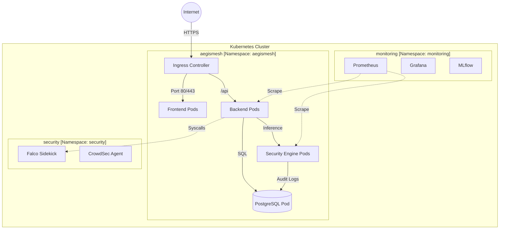

# Kubernetes (K8s) Architectural Specification: AegisMesh - IAM

## 1. Executive Summary
AegisMesh leverages a **GitOps-driven Kubernetes architecture** designed for high availability, extreme security isolation, and automated lifecycle management. The cluster is built on **k3s** (a lightweight, CNCF-certified distribution) hosted on AWS EC2, ensuring a small footprint with enterprise-grade features.

---

## 2. Cluster Foundation & Topology

### 2.1 Technical Core
- **Orchestration:** k3s (Lightweight Kubernetes)
- **Host Environment:** AWS EC2
- **Configuration Management:** Kustomize (Base/Overlay pattern)
- **Continuous Delivery:** ArgoCD (GitOps controller)

### 2.2 Logical Segmentation (Namespaces)
Isolation is enforced at the namespace level to minimize the blast radius of any single component failure or compromise.

| Namespace | Contents | Security & Resource Profile |
| :--- | :--- | :--- |
| `aegismesh` | Frontend, Backend, Security Engine, PostgreSQL | Primary application zone. Restricted egress. |
| `monitoring` | Prometheus, Grafana, Loki, MLflow | Observability stack. High memory/storage allocation. |
| `security` | Falco, CrowdSec | Privileged runtime security and network filtering. |

### 2.3 Visual Topology


---

## 3. Core Architectural Constructs

### 3.1 Ingress & TLS Management
- **Controller:** Nginx Ingress Controller.
- **Identity:** `cert-manager` manages Let's Encrypt certificates.
- **Why:** Centralizes traffic entry, providing a single point for WAF integration and SSL termination.

### 3.2 Secrets Management (Bitnami SealedSecrets)
- **Strategy:** Credentials are encrypted into `SealedSecret` resources and committed to Git.
- **Mechanism:** Only the in-cluster SealedSecrets controller holds the private key required to decrypt these into standard K8s `Secrets`.
- **Why:** Enables a "No-Human-Access" secret rotation policy and ensures Git is the true source of truth for the entire environment.

### 3.3 Zero-Trust Networking (Network Policies)
> [!warning] Default Deny
> By default, all inter-pod traffic is dropped. Communication is only possible through explicit opt-in via `NetworkPolicy`.

**Permitted Communication Paths:**
- `Internet` → `Ingress`
- `Ingress` → `Frontend`
- `Ingress` → `Backend` (`/api`)
- `Backend` → `Postgres`
- `Backend` → `Security Engine`
- `Security Engine` → `Postgres`

### 3.4 Resilience & Autoscaling
- **HPA (Horizontal Pod Autoscaler):** Targets a **70% CPU threshold**.
- **Deployment Strategy:** Uses **Argo Rollouts** for the Backend service.
  - **Canary:** Slowly shifts traffic (10%, 25%, 50%) to new versions.
  - **Blue/Green:** Instant cutover with automated rollback on health failure.
- **Why:** Reduces the risk of "all-hands" outages during updates and ensures the system handles traffic spikes autonomously.

---

## 4. Configuration & Lifecycle

### 4.1 Kustomize Layout
AegisMesh uses a tiered configuration structure:
```text
k8s/
├── base/                   # Shared manifests (Deployments, Services, ConfigMaps)
└── overlays/
    ├── dev/                # Local development/testing patches
    └── prod/               # Production-grade tags, HPA configs, and replicas
        └── kustomization.yaml   ← Patched by CI with unique immutable SHA tags
```

### 4.2 Application Initialization (Init Containers)
Each Backend pod must clear two hurdles before its application code executes:
1. **`wait-for-db`**: Polls the PostgreSQL service until it accepts connections.
2. **`prisma-migrate`**: Executes `prisma migrate deploy` to ensure the schema matches the code.
- **Impact:** Prevents "Zombie Pods" that appear healthy but crash because the database isn't ready or the schema is outdated.

---

## 5. Component Interconnectivity Map

| Component | Connected To | Logic/Why |
| :--- | :--- | :--- |
| **ArgoCD** | GitHub Main Branch | Pull-based deployment model; avoids opening cluster ports to CI. |
| **Falco** | Linux Kernel (via Sidekick) | Real-time intrusion detection via syscall monitoring. |
| **CrowdSec** | Ingress Layer | Filters traffic at the edge based on a global IP reputation database. |
| **MLflow** | Security Engine | Provides versioned models for real-time risk scoring. |
| **Prometheus** | /metrics Endpoints | Aggregates health data for HPA scaling decisions. |

---

### **Operator Summary**
This architecture is designed for **Autonomy**. The cluster self-heals, self-scales, and self-updates based on the state defined in Git. For manual intervention, refer to the [Operational Runbooks](guides/runbook-ci-cd.md).
